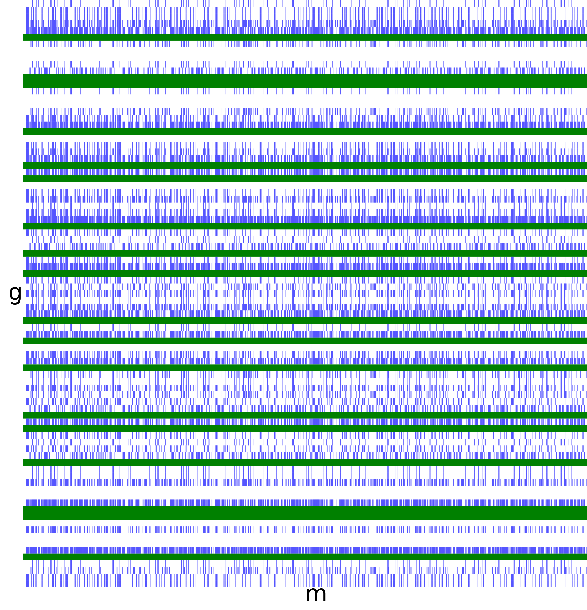

Code for 'Falling with Style: Factoring up to 255 "with" a Quantum Computer'
============================================================================

This repository contains the code used to collect the data shown in the
april fools paper 'Falling with Style: Factoring up to 255 "with" a
Quantum Computer'.

The paper (should) appear in Sigbovik 2025 proceedings, but [a copy](https://github.com/Strilanc/falling-with-style/releases/download/vSigbovik/falling-with-style.pdf) is also available from [this repository's releases](https://github.com/Strilanc/falling-with-style/releases/).

Example qasm circuits (before transpilation) are in the [example_circuits/](example_circuits/) subdirectory.

Figures
=======

Main Result

> 
>
> Left: A creative commons sketch of Buzz Lightyear [from Deviant Art](https://www.deviantart.com/jameson9101322/art/12-Buzz-Lightyear-186311087).
>
> Right: comparing the sample efficiency of factoring all numbers up to 255 with a variety of sampling devices.

Lucky values of g and (g, m)

> 
>
> The sample space of success for n=7*13. Some choices of the random value g immediately factor the number (green). For other values of g, certain values of the quantum sample m factor the number (blue). Shor's algorithm concentrates m towards blue regions, but the blue is widespread enough for small values that it's likely to hit it just by chance when picking m at random.

Differential success of perfect and random samples

> 
>
> For composite numbers less than 255, how many samples are needed in expectation when using a perfect quantum computer vs a random number generator.
> For such small numbers, the random number generator does surprisingly well.

Code Usage instructions
=======================

Install python dependencies:

```bash
pip install -r requirements.txt
```

Run the tests:

```bash
PYTHONPATH=src pytest src
```

Generate a factoring circuit:

```bash
PYTHONPATH=src python src/facto/main_generate_qasm.py --n 15 --g 2
```

Make the plot shown in the paper:

```bash
PYTHONPATH=src python src/facto/main_make_plot.py
```

Make the dartboard image `dartboard.png`:

```bash
PYTHONPATH=src python src/facto/main_make_dart_board.py 
inkscape --export-type="png" dartboard.svg > dartboard.png
```

Make the differential expectation image `expectation.png`:

```bash
PYTHONPATH=src python main_make_expectation_plot.py
```

Recollect the data from the quantum computer (very manual):

1. Consider changing the hardcoded random seed (currently `2025_04_01`) used in `src/facto/main_make_plot.py`.
2. Set the environment variable `QISKIT_TOKEN` to your ibm quantum token.
3. Delete the contents of the array in `store_collected_shots_from_jobs` in `src/facto/main_make_plot.py`
4. Modify the main method of `src/facto/main_make_plot.py`; comment the plot call and uncomment the call to `run_problems` and `send_jobs_to_ibm`.
5. Once the jobs finish submitting a few minutes later, add the printed contents to the `ACTIVE_JOBS` array, then remodify main to only have the call to `collect_job_results` uncommented.
6. Add the printed job results to the array in `store_collected_shots_from_job`, and clear `ACTIVE_JOBS`.
7. Goto step 4, unless no jobs were submitted (indicating no more samples requested for any number)
8. Remodify main to only call the plot command, run it, and look at your data
